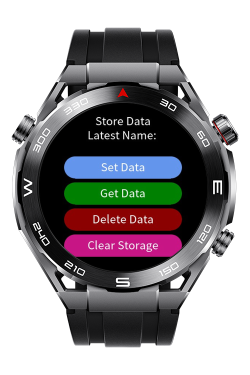
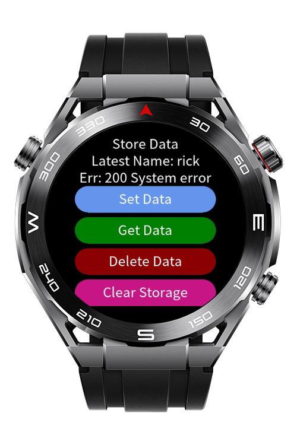

> **Note:** To access all shared projects, get information about environment setup, and view other guides, please visit [Explore-In-HMOS-Wearable Index](https://github.com/Explore-In-HMOS-Wearable/hmos-index).

# How To Use Storage

Simple storage usage in lite wearables.

# Preview
<p align="left">
    
    
</p>

# Use Cases

set, update, read, delete, clear data in the storage.

# Tech Stack

**Languages**: JS
**Frameworks**: HarmonyOS SDK 5.0.0(12)
**Tools**: DevEco Studio 5.1.0
**Libraries/Kits**:
- @system.storage

# Directory Structure
```
entry\src\main\js
└───MainAbility
    │   app.js
    ├───common
    │       storageManager.js
    └───pages
        └───index
                index.css
                index.hml
                index.js
```

# Constraints and Restrictions

## Supported Device
- Huawei Sport (Lite) Watch GT 4/5/6
- Huawei Sport (Lite) GT4/5 Pro
- Huawei Sport (Lite) Fit 3/4
- Huawei Sport (Lite) D2
- Huawei Sport (Lite) Ultimate

# License

**How To Use Storage** is distributed under the terms of the **MIT License**.
See the [LICENSE](LICENSE) file for more information.